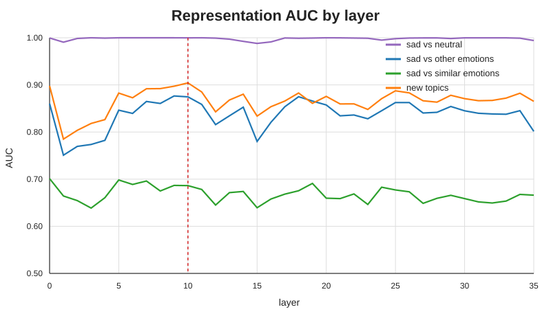
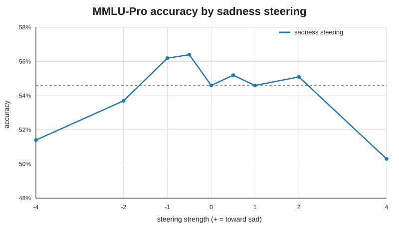
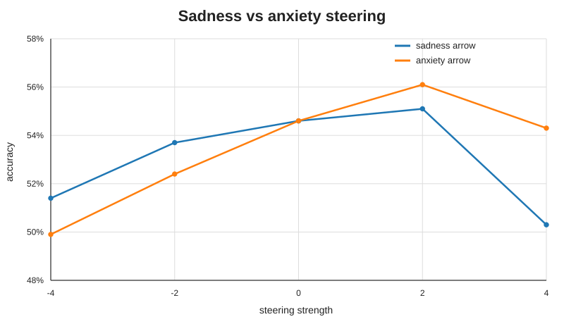
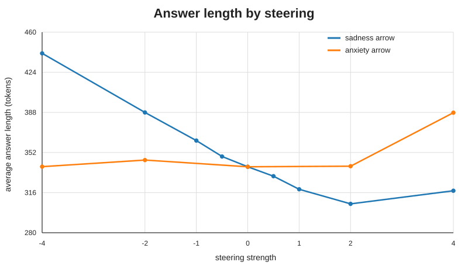
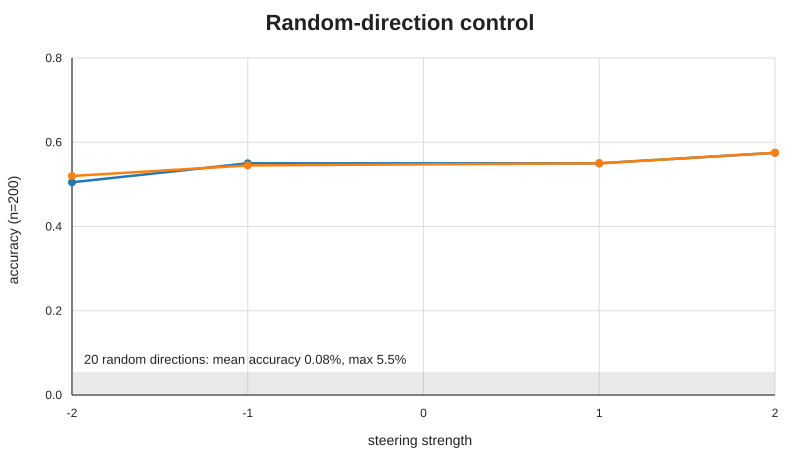
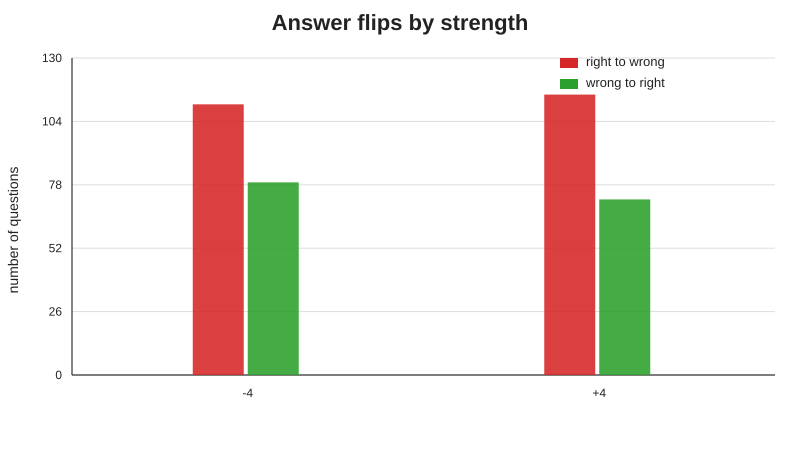
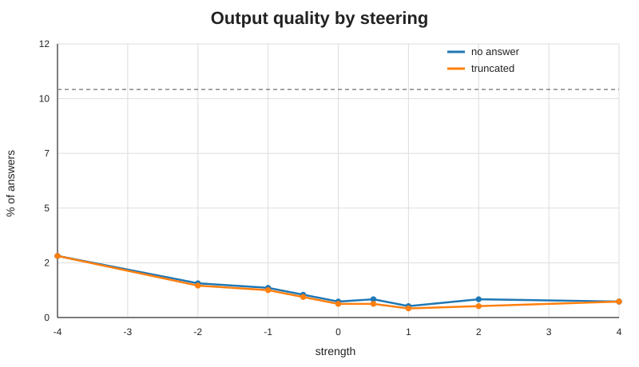
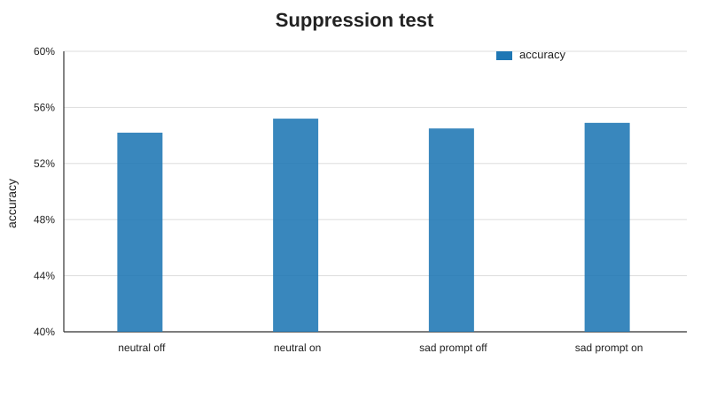

# Graphs

These are the main graphs from my sadness steering experiments. They summarize the representation tests, MMLU-Pro steering results, control experiments, and suppression test.

## 01 - Representation AUC by layer

**Purpose:** Check how well the sadness direction can separate sad stories from other stories at each layer.

**Result:** The sadness direction worked pretty well on held-out examples and also on topics it was not trained on. The main held-out AUC was about **0.877**, and the new-topic AUC was about **0.904**. Layer 10 was chosen for the steering experiments.

## 02 - MMLU-Pro accuracy by steering

**Purpose:** See how changing the sadness steering strength affects reasoning accuracy on 1,000 MMLU-Pro questions.

**Result:** The normal model got **54.6%**. The -1 and -0.5 levels were a little higher, but the differences were not statistically significant. The biggest change was at **+4**, where accuracy dropped to **50.3%**. This was the main statistically significant accuracy result.

## 03 - Sadness vs anxiety accuracy

**Purpose:** Check whether the accuracy change happens with another emotion direction too, or if it is more specific to sadness.

**Result:** At +4, sadness steering dropped to **50.3%**, while anxiety steering was **54.3%**, which was close to the normal model. This makes the +4 effect look more specific to the sadness direction, although more emotion controls would still be useful.

## 04 - Answer length by steering

**Purpose:** Check whether steering changes how long the model's answers are.

**Result:** Positive sadness steering generally made the answers shorter. The average went from about **388 tokens at -2** to about **306 tokens at +2**. Anxiety did not have nearly as large of a change, so this is something I want to investigate more.

## 05 - Random control accuracy

**Purpose:** Use random directions as a control to see whether any direction of the same size would cause similar changes.

**Result:** The random directions caused the model outputs to break down badly, even at fairly small steering strengths. Because of this, I do **not** think this is a fair control, and I am planning to replace it with a better control method.

## 06 - Answer flips by strength

**Purpose:** Look at how many individual questions changed from right to wrong or wrong to right, instead of only looking at total accuracy.

**Result:** Even when the total accuracy did not change much, a lot of individual answers still changed. At +4, **115** questions changed from right to wrong and **72** changed from wrong to right, which gives the 43-question net drop in accuracy.

## 07 - Output quality

**Purpose:** Make sure the accuracy results were not mainly caused by answers failing to parse or getting cut off.

**Result:** The parse failure and truncation rates stayed below about **3%**, which is well under the 10% cutoff I set. This means the main accuracy results are probably not just from broken or unfinished outputs.

## 08 - Suppression test

**Purpose:** Test whether giving the model a sad prompt changes its reasoning, and whether removing the sadness direction could undo that effect.

**Result:** The sad prompt itself did not cause a clear accuracy change. Because there was not much of an effect to reverse, I am treating the suppression test as **inconclusive** instead of saying it worked or failed.

